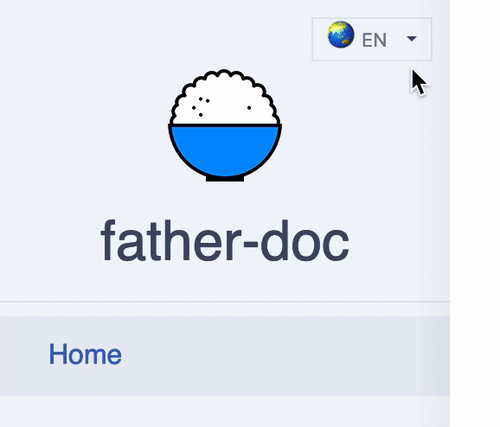

# Multi-language

Generally, our component documents are written in more than one language to satisfy the requirements of developers in different countries and regions. Based on dumi, you are able to switch multi-language mode for your documents by adding the suffix locale to `.md`.

## Examples

If our file directory structure is like this:

```
.
└── src/
    ├── index.en-US.md # if the defualt locale is en-US, index.md is equal with index.en-US.md
    ├── index.zh-CN.md
```

Then in the default configuration, the generated routes will ne looked like this:

```js
[
  {
    path: '/',
    // ...
  },
  {
    path: '/zh-CN',
    // ...
  },
];
```

The left side menu will change with the switch of the locale



That's all about this example.

## Default language and missing translation

In the default configuration of dumi, the default language is `en-US` and the second language is `zh-CN`. If you need to change this configuration, such as changing the default language or adding more languages, please check the [Config - locales](/config?#locales).

During the process of actual document writing, it is likely to be **incrementally** and **gradually**, for example, firstly, writing all the documents in the default language, and then translating them into other languages gradually, which will inevitably lead to a transition period of 『document translation to half』.

In order to make this transition period more smooth and friendly, **dumi will use the default language as the language of untranslated document**, which may be difficult to understand. Let's see a case.

Suppose the directory structure is as follows:

```
.
└── src/
    ├── missing/
    |   ├── index.md
    ├── index.md
    ├── index.zh-CN.md
```

Obviously, the Chinese translation of the document `missing` is missing, What means the content of `/zh-CN/missing` does not exist. So, dumi will automatically render the content of `/zh-CN/missing` to the content of the default language, which is the content of `/missing` route, so that to ensure that the document is accessible.

In the future, it is planned to add the prompt of missing translation to guide visitors to contribute translation for the document.

## Other agreements

### Locale suffix is optional

If a `.md` file does not have a locale suffix, it will be recognized by dumi as the default locale. For example, the default locale is `en-US`, then `abc.md` will be considered as `abc.en-US.md` by dumi.

### Validity of locale

If the locale is configured as `en-US` (default) and `zh-CN`, but dumi cannot find the suffix `zh-CN` in any `.md` file, then the locale of `zh-CN` will be deemed invalid by dumi and will not be presented to users on the site.

### Multi-language of `README.md`

If a site does not have a root route (It means there is no `index.md` or `README.md` in any root directory of `include`), dumi will render the `README.md` that in the project root directory as the root route; If it is in multi-language mode at same time, it will try to find `README.{locale}.md`, or it will fallback to `README.md`.
